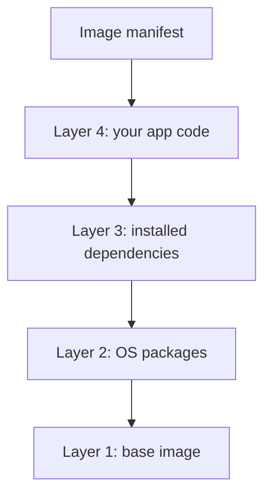

# INF 345 — Fundamentals of DevOps

## Lecture 4: Images, Layers & Multi-Stage Builds

<div class="pt-8 opacity-70">
Adil Akhmetov · Lesson 4
</div>

---
layout: default
---

# Recap — Lesson 3 (Containers 101)

<v-clicks>

- What's the difference between an image and a container? <span v-click class="opacity-60">(image = read-only template; container = a running instance of it)</span>
- Why did we copy `requirements.txt` and install it *before* copying the rest of the app? <span v-click class="opacity-60">(layer caching — that layer only rebuilds when requirements.txt changes)</span>
- Why shouldn't a container's main process run as root? <span v-click class="opacity-60">(a container escape or mounted volume can turn that into real host access)</span>

</v-clicks>

---
---

# Today's agenda

<v-clicks>

- [ ] Why image size is a real problem, not just an inconvenience
- [ ] What a layer actually is, and why instruction order matters
- [ ] Build-time vs run-time dependencies
- [ ] Multi-stage builds: the fix
- [ ] Choosing a minimal final base image
- [ ] Live demo → straight into today's practice

</v-clicks>

---
layout: center
class: text-center
---

# The scenario

<div class="text-lg text-left mt-4 max-w-2xl mx-auto">

You containerized your app last week. It works. Then you check the image
size: 1.2 GB. Your teammate's laptop takes three minutes just to pull it.
Your CI pipeline burns minutes on every single run downloading it.
Somewhere in that gigabyte is a full compiler toolchain nobody needs once
the app is built.

</div>

<div v-click class="mt-8 text-xl font-bold">
Most of what's in that image was only ever needed to build it — not to
run it.
</div>

---
layout: section
transition: slide-left
---

# Block 1
## What's actually inside an image?

---
---

# An image is layers, not a blob



<div v-click class="mt-6 text-sm opacity-70">
Each layer is a read-only diff on top of the one below it. Layers are
content-addressed, so identical layers are shared across images on the
same machine — pulling a second image with the same base is nearly free.
</div>

---
---

# Every instruction is (usually) a layer

```dockerfile {1|2|3|4|5|6}
FROM python:3.12-slim
RUN useradd -m appuser
WORKDIR /app
COPY app/requirements.txt .
RUN pip install -r requirements.txt
COPY app/ .
```

<div class="mt-4 text-sm opacity-70" v-click="6">
<code>FROM</code>, <code>RUN</code>, <code>COPY</code>, and <code>ADD</code>
each create a new filesystem layer. <code>WORKDIR</code>,
<code>EXPOSE</code>, <code>USER</code>, <code>ENV</code>, and
<code>CMD</code> just record metadata — no new layer.
</div>

---
---

# The layer cache — and why order matters

<v-clicks>

- Podman/Docker caches each layer, keyed on the instruction and the files
  it touches.
- If one layer's cache is invalidated, **every layer after it rebuilds
  too** — even if nothing else in your app changed.
- This is exactly why last lesson's Containerfile copied
  `requirements.txt` and ran `pip install` *before* copying the rest of
  the app: edit `app.py`, and the dependency-install layer's cache is
  still valid — only the last `COPY` reruns.

</v-clicks>

<div v-click class="mt-8 p-4 rounded bg-blue-500/10 text-sm">
The rule doesn't change today, it just matters more: put whatever
changes <i>least</i> near the top of the Containerfile, whatever changes
<i>most</i> near the bottom.
</div>

---
layout: center
class: text-center
---

# Quick check

<div class="text-xl mt-4 max-w-2xl mx-auto text-left">
You add one new Python package to <code>requirements.txt</code>. You
still copy it in and install it before copying the rest of the app. What
rebuilds when you run <code>podman build</code> again?
</div>

<div v-click class="mt-8 text-lg opacity-70">
Just the <code>pip install</code> layer and everything after it — not the
base image layers below it.
</div>

---
layout: section
transition: slide-left
---

# Block 2
## Multi-stage builds

---
---

# Why size matters, and where it comes from

<v-clicks>

- **Pull time.** Every deploy, every CI run, every new node pulls the
  full image over the network — minutes, multiplied by every machine
  that needs it.
- **Attack surface.** A compiler, package manager, and shell you never
  use at runtime are still sitting in the image — free tools for an
  attacker who gets in.
- **Build-time vs run-time.** To build a Go binary you need the
  compiler, module cache, and source. To *run* it you need... the
  binary. Not the compiler.

</v-clicks>

<div v-click class="mt-8 text-xl font-bold">
A single-stage Containerfile ships all of it, compiler included —
because everything happens inside one image.
</div>

---
---

# The problem, concretely

```dockerfile
FROM golang:1.23
WORKDIR /app
COPY app/go.mod .
COPY app/ .
RUN CGO_ENABLED=0 GOOS=linux go build -o server .
EXPOSE 8080
CMD ["./server"]
```

<div v-click class="mt-6 text-sm opacity-70">
Builds and runs fine — but ships the entire <code>golang:1.23</code> base
image, compiler included, for a server that's a few KB of actual binary.
Roughly <b>~800 MB</b>.
</div>

---
---

# The fix: multi-stage builds

```dockerfile {1-6|8-12|all}
# ---- build stage ----
FROM golang:1.23 AS builder
WORKDIR /src
COPY app/go.mod ./
RUN go mod download
COPY app/ .
RUN CGO_ENABLED=0 GOOS=linux go build -o /out/server .

# ---- final stage ----
FROM alpine:3.20
RUN adduser -D -u 1000 appuser
COPY --from=builder /out/server /usr/local/bin/server
EXPOSE 8080
USER appuser
CMD ["server"]
```

<div v-click class="mt-4 text-sm opacity-70">
Two <code>FROM</code>s, two stages. Only the last one becomes your final
image — earlier stages are scratchpads, referenced by name
(<code>--from=builder</code>) or index (<code>--from=0</code>), thrown
away except for whatever you explicitly <code>COPY --from=</code> out of
them.
</div>

<div v-click class="mt-2 text-lg font-bold">
~800 MB → ~15 MB. Same binary, same behavior — just without dragging the
compiler along for the ride.
</div>

---
---

# Choosing a minimal final base

| | `scratch` | distroless | `alpine` |
|---|---|---|---|
| Size | 0 MB | ~2 MB | ~5-7 MB |
| Shell / package manager | None | None | Yes (`ash`, `apk`) |
| Non-root user | Numeric `USER` only (e.g. `USER 65532`) | Ships a built-in `nonroot` user | `adduser` in one `RUN` line |
| Debug inside the container | Not possible | Not possible | `podman exec` + shell works |
| Best for | Fully static binaries, absolute minimum | Static binaries, still want a real UID | Default choice when unsure |

<div v-click class="mt-6 text-sm opacity-70">
For today's practice, <code>alpine</code> keeps things simple: you get a
shell to debug with, and creating a non-root user is one command.
</div>

---
---

# `.dockerignore`, and checking your work

<div class="grid grid-cols-2 gap-6">
<div>

**`.dockerignore`** — like `.gitignore`, scoped to the build context.
Without it, `.git/`, build artifacts, or stray secrets can end up in the
context even if no `COPY` names them directly.

```
.git
*.md
bin/
```

</div>
<div>

**`podman history`** — lists every layer, its size, and the instruction
that created it.

```bash
podman history practice04
```

First move when an image is bigger than expected: find the fat layer,
then fix the instruction that created it.

</div>
</div>

---
layout: section
transition: slide-left
---

# Block 3
## Today's practice

---
---

# Today's practice — a multi-stage Go build

<div class="grid grid-cols-2 gap-6 text-sm">
<div>

Your repo has `app/main.go` and `app/go.mod` — a tiny Go server that
responds `INF345 Practice 04 OK` on port `8080`. You don't write or touch
the app. Write a **multi-stage** `Containerfile` at the repo root:

1. `FROM golang:1.23 AS builder` — `CGO_ENABLED=0` for a static binary
2. A separate, minimal final stage (`alpine:3.20` or `scratch`)
3. `COPY --from=builder` — only the compiled binary
4. `EXPOSE 8080`
5. A non-root `USER` before the final `CMD`
6. `CMD` the binary on `0.0.0.0:8080`

</div>
<div>

```bash
podman build -t practice04 .
podman run --rm -p 8080:8080 practice04
curl localhost:8080
# → INF345 Practice 04 OK
podman images practice04
# → should be well under 50 MB
```

<div v-click class="mt-4 opacity-70">
Graded automatically: multi-stage structure, build succeeds, correct
response, final image under 50 MB, no leftover Go toolchain.
</div>

</div>
</div>

---
---

# By the end of this lesson, you should be able to

<v-clicks>

- [ ] Explain what a layer is and why instruction order affects the cache
- [ ] Explain why image size matters beyond "it's slow to download"
- [ ] Write a multi-stage Containerfile that separates build-time from
      run-time
- [ ] Choose a sensible minimal final base image for a compiled app

</v-clicks>

---
layout: default
---

# Before next lecture

- [ ] Finish today's practice if you didn't wrap it up in session — same
      Maru submission flow as last time
- [ ] Keep the RHA DO188 lab moving — still due Week 6

<div class="mt-8 text-sm opacity-60">
Nothing new to start here — just don't let the DO188 lab pile up.
</div>

---
layout: end
---

# Next lecture

Container networking & volumes — how containers talk to each other and
the outside world, and where your data actually lives.
